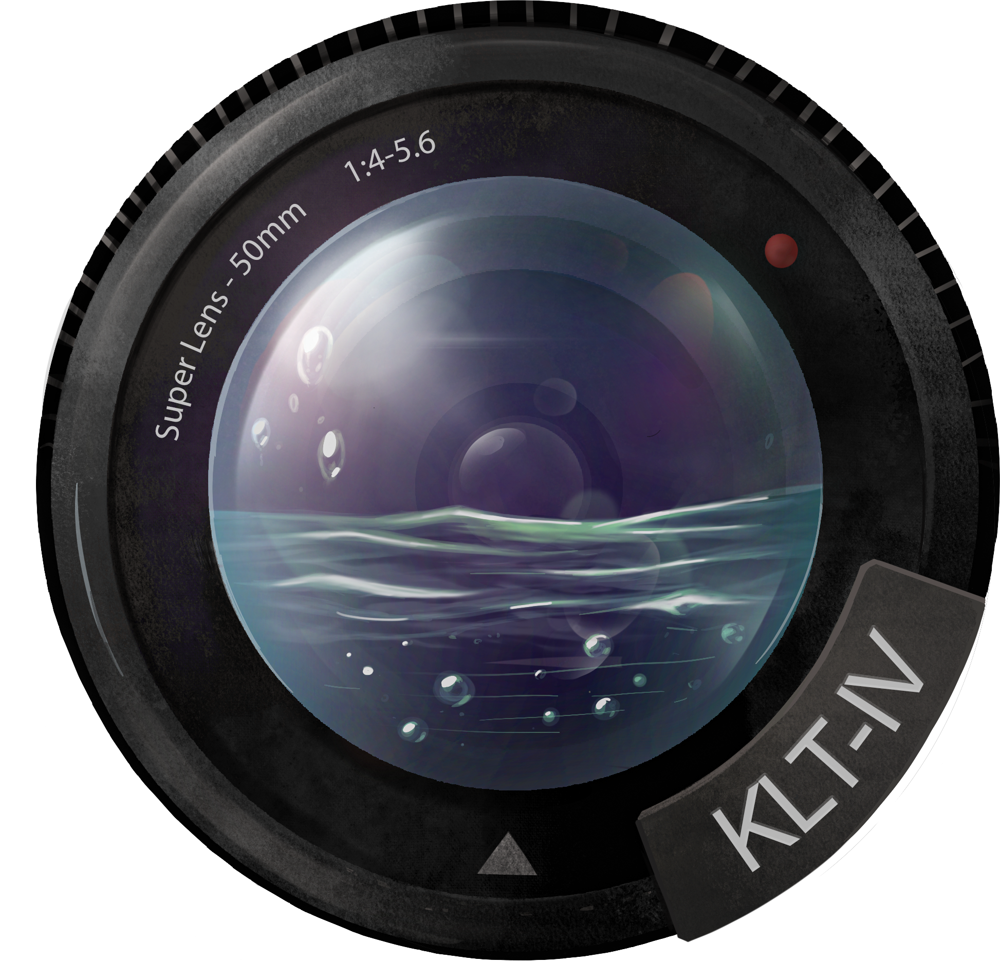
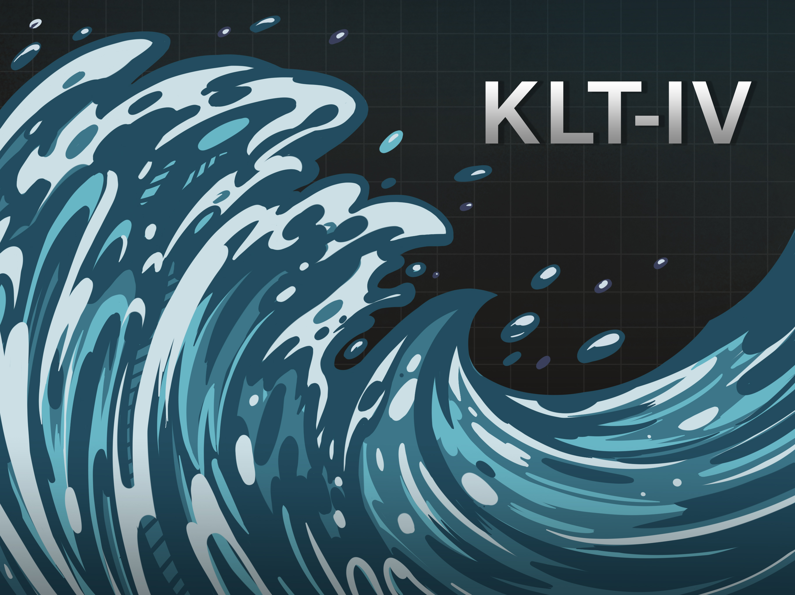

 
  

<h1 align="center"> KLT-IV </h1>
<h3 align="center"> Image velocimetry software for use with fixed and mobile platforms </h3>  

 

 
  

<!-- TABLE OF CONTENTS -->
<h2 id="table-of-contents"> :book: Table of Contents</h2>

  
Table of Contents

  <ol>
    <li><a href="#about-the-project"> ➤ About The Project</a></li>
    <li><a href="#prerequisites"> ➤ Prerequisites</a></li>
    <li><a href="#Repository Structure"> ➤ Repository Structure</a></li>
    <li><a href="#Getting started"> ➤ Getting started</a></li>
    <li><a href="#Legal"> ➤ Legal</a></li>
  </ol>

<!-- ABOUT THE PROJECT -->
<h2 id="about-the-project"> :pencil: About The Project</h2>

 
This project seeks to provide software capable of accurately estimating 2D river flow velocities and flow disharge using optical imagery acquired from a range of remote sensing platforms. A complete workflow is provided which enables a range of video formats (mp4, avi, etc) to be used as the basis for analysis. Image stabilisation routines are available when using mobile platforms (e.g. UAVs), and orthorectification of vectors, or imagery is dealt with through application of a distorted camera model. Image analysis utilises the Kanade-Lucas-Tomasi feature detection and tracking procedures providing 2D velocity vectors. Post-processing of vectors is achieved through application of threshold filters and angle-based trajectory filtering. Discharge analysis is completed through application of surface &alpha; and inclusion of cross-section data.

<!-- PREREQUISITES -->
<h2 id="prerequisites"> :fork_and_knife: Prerequisites</h2>

  

This project requires MATLAB 2019a, or later in addition to the following packages:
* Mapping Toolbox
* Image Processing Toolbox
* Statistics and Machine Learning Toolbox
* Curve Fitting Toolbox
* Computer Vision Toolbox

The following open source packages are used in this project:
* [ffmpeg](https://ffmpeg.org/)
* [imGRAFT](https://github.com/grinsted/ImGRAFT)
* [mlapptools](https://github.com/StackOverflowMATLABchat/mlapptools)

<!-- Repository Structure -->
<h2 id="Repository Structure"> :cactus: Repository Structure</h2>

 
  
* There are currently two branches of KLT-IV software on Git. 
* [v1.02](https://github.com/CatchmentSci/KLT-IV/tree/v1.02) is the most recent, tested version.
* [main](https://github.com/CatchmentSci/KLT-IV/tree/main) is undergoing active development and has not been fully tested.

Below is the an outline of the folder structure within the `main` branch with descriptions provided:

    .
    ├── code                    # folder containing scripts to run KLT-IV
    │   ├── depreciated         # a number of files no longer used by KLT-IV
    │   ├── external            # third party software required
    │   ├── ffmpeg              # video editing/encoding software
    │   ├── gui                 # files required to build the GUI
    │   ├── klt                 # core files for running KLT-IV functions
    ├── compiled                # folder containing installation files for compiled version
    │   ├── for_redistribution  # folder containing installation files for KLT
    ├── compiled resources      # additional resources for compilation
    ├── images                  # folder containing graphics for KLT-IV
 
  

<!-- Getting Started -->
<h2 id="Getting started"> :runner: Getting started</h2>

 
  
* Either download, or clone this repository to the hard drive on your PC.
* Open MATLAB, ensure that the folder and all sub-folders from this repository are present on the search path e.g. `addpath(genpath('D:\KLT-IV\'))`.
* Either open the KLT.m file from within the `klt` subfolder and click Run (in Editor tab), or type `KLT` in to the command window. This will load the GUI. 
* A full outline of the workflow and description of the functionality can be found [here](https://gmd.copernicus.org/articles/13/6111/2020/gmd-13-6111-2020.html)

<!-- Getting Started -->
<h2 id="Legal"> :cop: Legal</h2>

 
  
  **Disclaimer:** This software is provided “as is”, without warranty of any kind, express or implied, including but not limited to the warranties of merchantability, fitness for a particular purpose and noninfringement. In no event shall the authors or copyright holders be liable for any claim, damages or other liability, whether in an action of contract, tort or otherwise, arising from, out of or in connection with the software or the use or other dealings in the software. 

**License:** Licensing information can be found in the LICENSE.txt file

 
  

